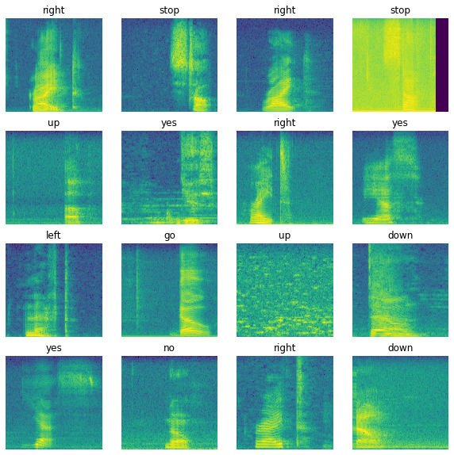
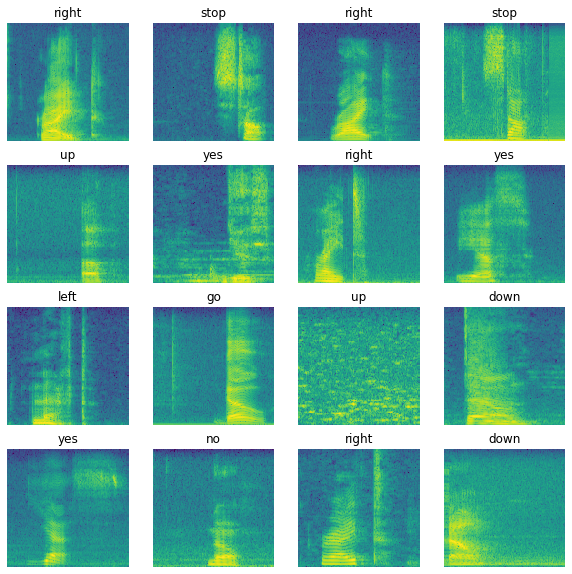

# Spectrogram Imputation
Experimenting with improving tensorflow speech recognition tutorial using imputation of missing data

## Idea

The tensorflow tutorial handles audio files of different length by padding with zeroes. This results in (log)spectrograms like the following: 

I was curious if a more sophisticated imputation could do better. I was also curious if taking the log of the magnitudes in the spectrogram, which appeared to result
in more normally distributed entries, would improve performance. In the end, the inputation/log transform did not significantly change the results - simply training for longer made a much bigger difference. But imputing did result in much prettier pictures!

## Imputation method

One visually observes that the "background" in the spectrogram has a consistent pattern of frequencies. This means that the background takes nearly the same value accoss each 
row of the spectrogram. To imitate this, I simply replaced the missing entry in the (log) spectrogram with the mean across that row plus some white noise with variance
equal to the variance of the row scaled by some fudge factor that I visually tuned. 

They look like this: 

The ultimate accuracy of the model was 86%, but the same accuracy could be obtained without imputing.
